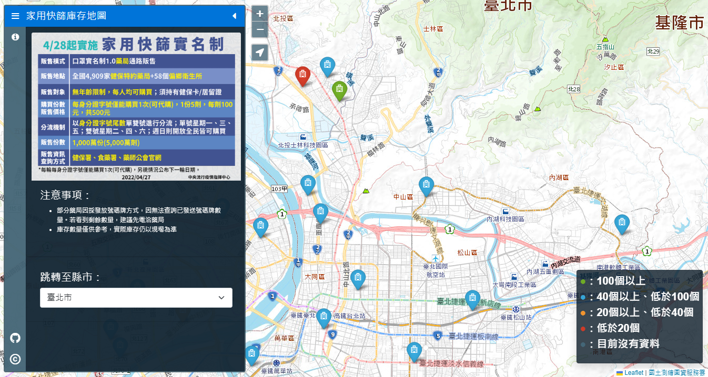

# 健保特約機構家用快篩庫存地圖

## 前言

因應臺灣疫情變嚴重，繼前年`口罩實名制之亂`，現在又來一個快篩實名制要進行排隊購買，因此想說有如果開發一個對應大神 [口罩地圖](https://kiang.github.io/pharmacies) 的快篩版本，
對隨時會感染的現況應該有所幫助。

雖然大神很快就套版弄出新的 [快篩地圖](https://kiang.github.io/antigen/) ，但是我還是想自己寫。

與大神版本最大的差別為：

- 不靠自建伺服器來執行抓取資料排程
- 個人純粹不想用 `Scripting Languages` 像是 `Python`、`PHP`

因此在技術的選型上走了以下的邪門歪道：

- 語言 `Java` + `JUnit`
- 利用 `Maven Test Phase` 自動執行 Test 的方式，進行資料抓取及轉換流程
- 透過 `Github Actions` 模擬 `CI` 方式，定時建構 `Maven` 產出後端資料
- 此前端專案則直連後端資料進行視覺化展示

前端 UI 方面就八成參考 [口罩地圖](https://kiang.github.io/pharmacies) 了，以示我對原作者的尊敬(X)。

## 後端資料

- [資料直連](https://vipcube.github.io/opendata.gov.tw/rapidTestStock.json)
- [後端資料集 Github](https://github.com/Vipcube/opendata.gov.tw)

## Changelog

### 2022/05/01

- 完成版本 🎉🎉🎉🎉
- 新增縣市跳轉功能
- 借鑿 Google 導航功能
- 更新 README.md

### 2022/04/30

- 專案初始
- 初步 UI Layouts
- 因應半夜開發中藥局資料忽然爆量造成圖層讀取負荷很大，修正藥局圖層讀取機制為僅讀取 `BBox` 範圍內資料，避免網站卡頓。
